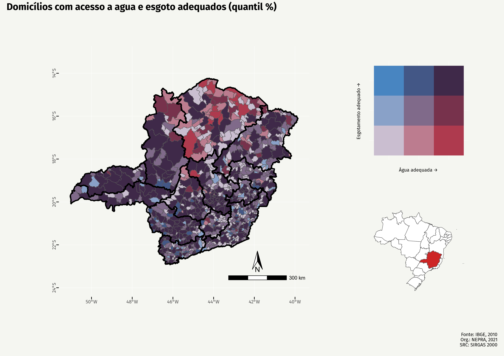
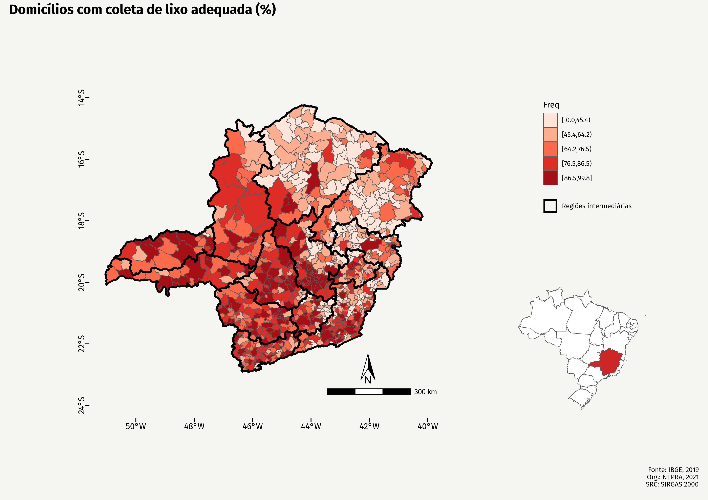
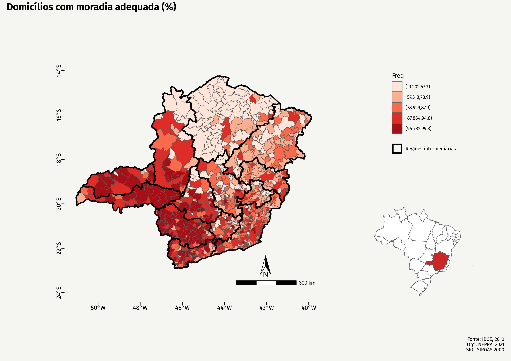
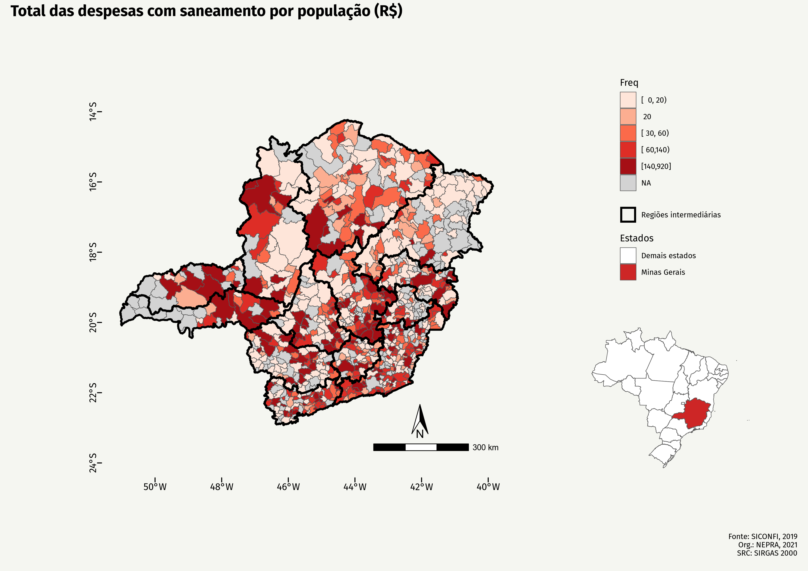
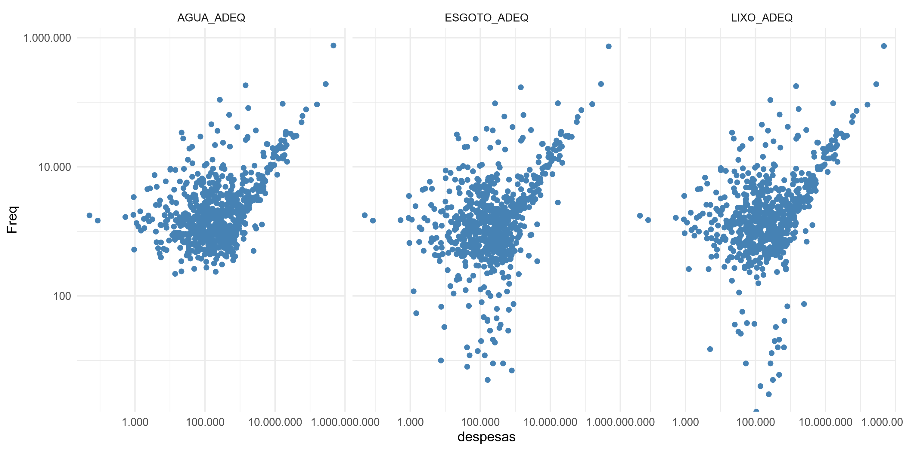

```{r setup, include=FALSE}
knitr::opts_chunk$set(message = FALSE, warning = FALSE, echo = FALSE, eval = TRUE)
```

# Mapas

Ao observar a frequência relativa de domicílios com acesso a serviços de saneamento básico por município de Minas Gerais evidencia-se uma desigualdade que se desdobra em duas dimensões: uma regioinal e uma relativa aos serviços. Municípios localizados de sul e a oeste do estado apresentam maior equilíbrio no acesso a serviços adequados de abastecimento de água e coleta de esgoto, bem como maior acesso a estes serviços em valores proporcionais. Regiões intermediárias como as de Uberlândia e Uberaba apresentam poucos municípios em que há maior acesso domiciliar à coleta adequada de esgoto do que abastecimento adequado de água. Este cenário não é acompanhado pela realidade dos municípios ao Norte do Estado, onde se observa mais municípios que conseguem suprir apropriadamente demanda de água em vista da demanda por esgoto, em maior grau na região de Montes Claros mas também na porção norte da região de Patos de Minas e em determinadas localidades da região de Teófilo Otoni.

```{r aguaesgoto, out.width="100%", fig.cap="Água e esgoto por domicílio em Minas Gerais"}

```

No que tange ao acesso a serviços de coleta de lixo, o mesmo padrão observado se acirra.

```{r lixo, out.width="100%", fig.cap="Adequação da coleta de lixo domiciliar por município em Minas Gerais"}

```

```{r adequacao, out.width="100%", fig.cap="Adequação domiciliar por município em Minas Gerais"}

```

```{r despesas, out.width="100%", fig.cap="Despesas com saneamento por população por município em Minas Gerais"}

```

```{r saneamentodespesas, out.width="100%", fig.cap="Componente do saneamento domiciliar por despesas por município em Minas Gerais"}

```
